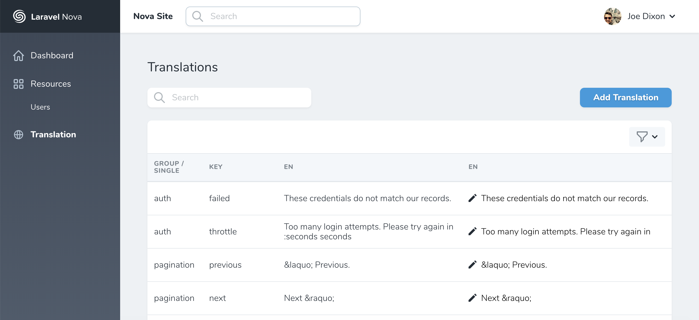

<div align="center">
  

  
Translation management for your Nova application.



</div>

------

## About Nova Translation

Nova Translation is a tool for Laravel Nova which allows you full control
over your translations when using [Laravel's
localization](https://laravel.com/docs/5.7/localization) functionality.

The package allows you to manage your translations using either the native file
based translations, but also provides a database driver which is useful in
multi-server setups.

It exposes a user interface allowing you to update existing and add new
translations to your application.

Below are a full list of features:

- File and database drivers
- Database translation loader (automatically load translations from the database
  when Laravel's translation retrieval methods and the database driver)
- User interface to add new languages and add and update translations
- Artisan commands to manage your translations
- Scan your application for missing translations

## Installation

From the root of your Nova application run the following:

`composer require joedixon/nova-translation`

Open `NovaServiceProvider.php` and add update the `registerTools` method as
follows:

```
<?php

namespace Laravel\Nova;

...
use Joedixon\NovaTranslation\NovaTranslation;

class NovaServiceProvider extends ServiceProvider
{
    ...

    protected function registerTools()
    {
        Nova::tools([
            ...
            new NovaTranslation,
        ]);
    }
}
```

**Note:** Under the hood, this tool uses the `joedixon/laravel-translation` package. You
can find configuration instructions [here](https://github.com/joedixon/laravel-translation).